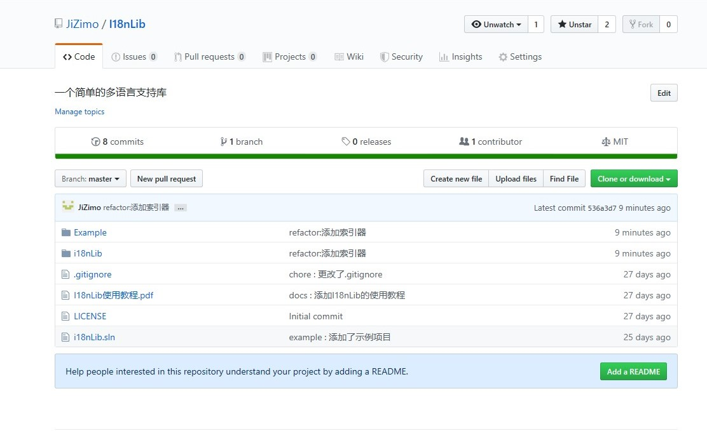
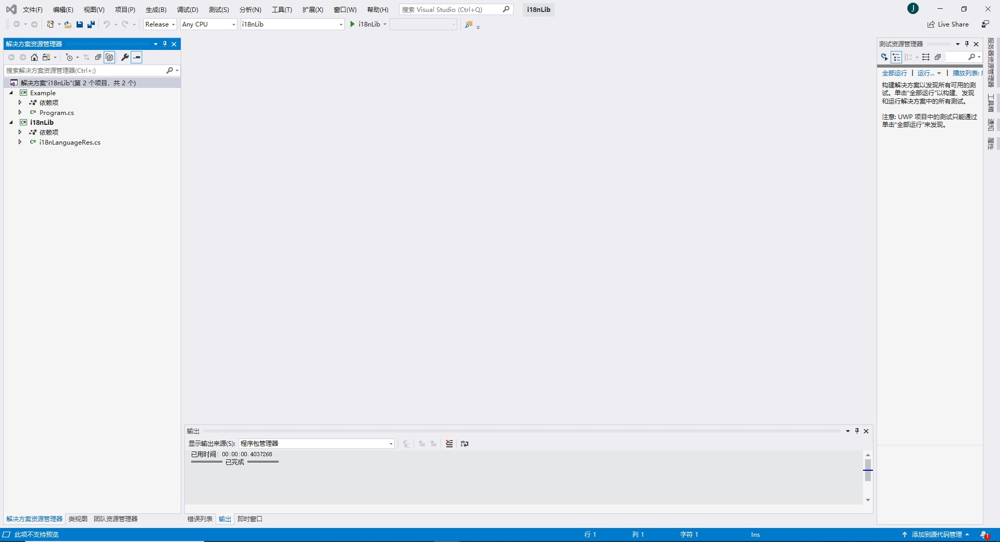
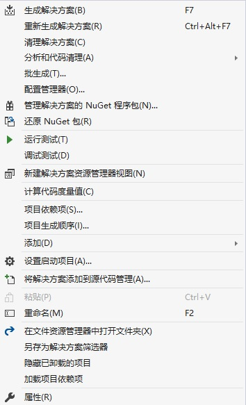

# 开始
首先，我们需要从因特网上获取该库的一个副本，该项目的 Github
网址：https://www.github.com/JiZimo/I18nLib： 

 
您可以通过该网址直接下载该项目的 zip 压缩包文件，然后将其全
部解压缩至您的工作目录，打开 i18nLib.sln。配置管理器选择
Release 

选择生成解决方案

然后就可以在 I18nLib
master\i18nLib\bin\Release\netstandard2.0 目录下找到 i18nLib.dll 
即可使用该库 